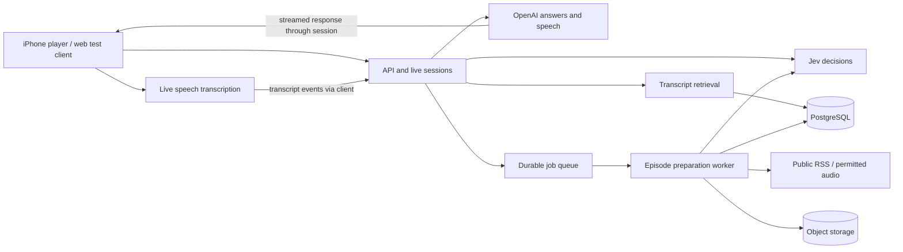

# Murmur backend rewrite — draft for review

Plan recorded 19 September 2026. The user subsequently authorized implementation of stages 1 and 2 only.

**Implementation status:** the `/listen` slice and persistent backend are built, with web playback, provider integration, database/job tests, and an iOS JavaScript export verified. Physical iPhone microphone/echo testing is still a stage-1 gate. The measured complete-speech response takes about six seconds after transcription, so the proposed first-audio latency target is not yet met. See [BACKEND_V2.md](BACKEND_V2.md) for the delivered scope. Stages 3–6 remain planned; no production cutover has occurred.

Build a podcast player that understands what the listener is hearing. Users can interrupt an episode, control playback, ask about a passage, explore a topic, and return to their place. Jev supplies semantic decisions throughout that experience; durable transcripts and precise playback state supply the evidence those decisions need.

**Agreed first-release scope**

- iPhone voice interaction while Murmur is open, with web as a development and testing surface.
- Public podcasts distributed through RSS. Support catalog search, direct RSS import, and supported public podcast links that resolve to a feed.
- Playback inside Murmur; voice controls, episode questions, spoken explanations, follow-up questions, and return to the episode.
- Ad skipping on request when Murmur has a validated ad range for the audio being played.

Planning assumptions: English first; episode-scoped questions initially, with catalog discovery across shows. Cross-podcast research, private subscriptions, platform-exclusive audio, lock-screen voice activation, and offline AI can follow later. Pasting a podcast link belongs in an import/share flow; natural-language interaction stays voice-first.

**What changes from the current application**

The current backend refactor separates handlers and providers and adds optional Jev routing. It does not provide durable episode ingestion, generated transcripts, indexing, accounts, background jobs, or a coordinated streaming conversation. The client currently assembles much of the episode context and listening state.

The rewrite moves episode intelligence and conversation orchestration into a new backend. Keep the existing interface initially, but replace its session integration and adapt native audio handling. A backend rewrite alone cannot solve microphone echo, playback interruption, or stale player actions on the phone.

**The experience to build first**

1. Import or find a public episode and begin listening.
2. Murmur uses an existing transcript or prepares one. Playback and transcript preparation have separate progress states.
3. Activate voice, initially with a microphone button; prove foreground “Hey Murmur” activation on a physical iPhone early.
4. Murmur pauses the episode and saves the actual player position and audio version.
5. “Go deeper on that” retrieves the passage around that position and related passages from the episode. Murmur gives a short spoken explanation and accepts follow-ups.
6. “Back to the podcast” restores the saved position. “Skip this ad” seeks only when an eligible ad range contains the current position.

The first demonstration should cover this complete loop on one prepared episode, then expand to varied public feeds. Do not wait for a large catalog before testing the interaction on a phone.

**Jev's role**

Jev currently accepts text and returns typed judgments and probabilities. It does not transcribe audio or generate spoken explanations. Use OpenAI for listener transcription, answer generation, and speech, with separate adapters for each responsibility. [TypeSafe System One](https://docs.typesafe.ai/concepts/system-one)

| Product need | Jev decision | What application code owns |
| --- | --- | --- |
| Understand a request | Choose a supported action, including unclear/no-match | Validate the action against session state and execute it |
| Interpret “that” or “the earlier explanation” | Select among supplied passage/topic candidates | Construct candidates and preserve their exact source spans |
| Answer an episode question | Rank a retrieved shortlist for relevance | Retrieve evidence, enforce scope, generate an answer with source references |
| Find ads | Judge whether supplied transcript windows are advertising and select boundary candidates | Derive times from aligned media, validate ranges, and decide eligibility |
| Detect missing context | Judge whether supplied evidence addresses the question | Explain missing coverage or ask a concise clarification |

Use Choice for bounded alternatives and Noul for independent yes/no judgments. Batch independent questions over the same state; retrieve new evidence before asking questions that depend on it. Parse explicit quantities such as “back 30 seconds” in code. Jev selects supplied values or spans; it must not invent timestamps or arbitrary tool arguments. [TypeSafe function calling](https://docs.typesafe.ai/cookbooks/function_calling)

Retrieve transcript candidates with text/vector search before asking Jev to rank them. Keep the shortlist bounded. [TypeSafe reranking](https://docs.typesafe.ai/cookbooks/rerank_typesafe)

Treat confidence as an input to a tested policy, not proof of correctness. Calibrate thresholds using Murmur examples and the consequences of each action. Clear, already-supported playback commands can execute deterministically. If Jev is unavailable, those controls remain usable; ambiguous semantic actions ask the user to retry or clarify.

**Recommended architecture**

Use one TypeScript backend codebase with two independently deployable processes: an API/session service and a background worker. Start with modules, rather than a network of small services.

- API/session service: authentication, catalog access, session events, Jev orchestration, evidence retrieval, streaming answers, and usage limits. Recommend [Fastify](https://fastify.dev/docs/latest/) with runtime-validated shared contracts.
- Database: PostgreSQL for episode records, timed segments, progress, sessions, and job state. Start with full-text search and add [pgvector](https://github.com/pgvector/pgvector) for semantic retrieval.
- Jobs: a PostgreSQL-backed queue such as [pg-boss](https://github.com/timgit/pg-boss), with idempotent job handlers and explicit retry policies.
- Worker: RSS normalization, media probing/decoding, transcript generation and alignment, indexing, and ad candidate analysis.
- Object storage: permitted audio renditions, transcript artifacts, and temporary preparation files with retention policies.
- Hosting: choose a service that supports long-lived connections and a separate worker capable of media processing. Do not force long transcription jobs into request handlers.

Keep providers behind adapters. Jev owns semantic judgments; the database owns durable evidence; domain code owns valid actions. Hosting vendor, managed identity provider, and embedding model remain implementation choices to settle after the first measurements.

**Podcast and transcript preparation**

On import, resolve the feed and episode, record provenance, identify the available audio rendition, and enqueue preparation. Normalize feed duplicates and refresh metadata without conflating different audio versions.

Prefer an accessible publisher transcript, then generate a transcript when an allowed audio source has none. A transcript visible in another podcast app is not an assumed public transcript API. Publisher-provided RSS transcripts are a supported route. [Apple's publisher transcript guidance](https://podcasters.apple.com/support/5316-transcripts-on-apple-podcasts)

Persist timed segments with source text, language, optional speakers, audio version, processing version, and coverage intervals. Keep word timings where available. Long episodes require bounded chunks, overlap reconciliation, and offsets mapped back to the original recording. OpenAI's file transcription guide distinguishes timestamp-capable formats/models and imposes upload limits; evaluate a timestamp-producing baseline against higher-quality transcription plus alignment before choosing the production pipeline. [OpenAI file transcription](https://developers.openai.com/api/docs/guides/speech-to-text)

Do not use the listener's live transcription session as the podcast transcript pipeline. The current live transcription model does not provide word timestamps or speaker labels. [OpenAI live transcription](https://developers.openai.com/api/docs/guides/realtime-transcription)

Track preparation as `not_requested`, `queued`, `processing`, `partial`, `ready`, or `failed`, with independent capabilities:

| Capability | Required evidence | User-facing behavior |
| --- | --- | --- |
| Playback | Playable source | Start listening immediately when the source allows it |
| Explain this moment | Coverage around the saved playhead | Answer from that passage; otherwise say this section is still being prepared |
| Search the episode | Indexed coverage | Search covered regions and disclose incomplete coverage |
| Skip this ad | Eligible range and matching audio timeline | Seek to the range end; otherwise explain that this ad is not ready to skip |

Prioritize the current listening window and look-ahead when the source can be decoded and aligned reliably. Otherwise process progressively and show honest coverage. Do not estimate time offsets from byte position for variable-bitrate audio.

Prepare requested episodes on demand; share reusable artifacts only for the same permitted audio version. Cap episode length and processing spend, deduplicate jobs, and allow failed preparation to resume. A newly imported two-hour episode will not necessarily support every question immediately.

**Audio identity and reliable ad skipping**

Dynamic insertion can change audio independently of an episode's title, GUID, or URL. Apple also documents transcript mismatches when dynamically inserted audio changes. Therefore, Murmur must bind timed evidence to the rendition actually played. [Apple transcript behavior](https://podcasters.apple.com/support/5316-transcripts-on-apple-podcasts)

Preferred path: analyze and play a pinned immutable rendition where processing, caching, and serving that content are permitted. Record a content identity and media duration. Public RSS availability alone is not an assumption that Murmur may rehost every episode; establish the supported ingestion modes before broad rollout.

For direct publisher streaming, duration and feed URL alone do not establish timeline identity. Enable precise transcript navigation and ad skips only when a reliable rendition identity or validated alignment establishes the corresponding interval. If that cannot be established, retain playback and ordinary relative seeking, and mark precise features unavailable. The early prototype must prove at least one reliable media path rather than promise universal dynamic-ad support.

Ad processing:

1. Collect publisher/manual ranges where available and generate transcript-based candidates with Jev.
2. Distinguish paid promotions and host-read ads from editorial brand mentions, show discussion, and quoted advertisements.
3. Use timed words, surrounding context, and alignment checks to derive candidate start/end points. Merge adjacent validated advertising ranges.
4. Store provenance, model/rubric version, semantic scores, alignment evidence, and validation status separately.
5. Promote candidates only under a policy demonstrated on labeled audio. A high Jev score alone never makes a range eligible.
6. On a skip request, recheck audio version, current playhead, range validity, and session freshness; then issue a seek with an acknowledgement.

First release: user-requested skipping, not automatic removal of all ads. If no eligible range contains the playhead, do not guess an endpoint. Offer ordinary forward seeking as a separate explicit command. Provide an easy undo for an executed skip.

**Live voice and player coordination**

Recommend a streaming pipeline: listener speech → transcription → Jev/action routing → playback action or evidence-backed answer → streamed speech. This makes command selection and episode evidence independently testable.

Start live audio with a short-lived, server-issued provider credential. Validate the actual browser and iPhone transports in the device prototype. The application sends normalized transcript events to its authenticated session service; provider secrets stay on the server. Associate events with utterance IDs because transcription completion can arrive out of order. [OpenAI live transcription](https://developers.openai.com/api/docs/guides/realtime-transcription)

The client owns observed playback position. At activation, pause locally and capture episode ID, audio version, player time, playback rate, and a monotonically increasing session revision. The backend retains the conversation bookmark; timestamps are measured in media time, independent of playback speed.

Use an explicit state machine: playing → listening → resolving → speaking → follow-up or returning. Clarification, cancellation, preparation, disconnection, and provider failure are explicit transitions. Never resume automatically after a failed action unless that behavior is clearly part of the current user request.

Every turn and proposed playback action carries an ID and session revision. The client rejects stale actions after an episode switch, manual seek, or newer command, and acknowledges the actual resulting player position. Retried delivery cannot execute a seek twice.

Stream answer text into an ordered speech queue at stable sentence boundaries. Interruptions cancel generation, pending speech, and queued playback actions for the superseded turn. References resolve to stored segment IDs and their validated timestamps; reject generated references that are absent from retrieved evidence. Separate episode-supported statements from general explanations, and avoid claiming current external verification without a retrieval source.

Foreground wake activation should preferably use local detection, with an obvious listening indicator and microphone-button fallback. The current prototype continuously sends microphone audio for cloud transcription to detect its wake phrase; do not carry that cost and privacy behavior into the new default without an explicit product decision. Test false wakes caused by the podcast itself.

An early native audio spike must cover speaker echo, headphones, Bluetooth, interruptions, and speaking over an answer. A custom Expo development build may be needed; Expo Go compatibility is not a release requirement. On leaving the foreground, end voice capture and persist the session. Background playback and system voice surfaces are separate future decisions.

**Persistent records and contracts**

Core records: feeds/shows, episodes, audio versions, preparation runs, transcript segments and coverage, ad candidates/eligible ranges, users or guest identities, listening sessions, bookmarks, conversation turns, jobs, and usage events.

Proposed versioned API surface:

- Catalog search, feed/link import, episode details, preparation request, and readiness/coverage lookup.
- Create/resume/end a listening session and obtain a narrowly scoped voice credential.
- A session event connection for player observations, utterances, cancellation, clarification, answer/speech delivery, action proposals, acknowledgements, and preparation changes.
- Progress/bookmark persistence and user data deletion.

The server selects trusted transcript context, allowed models, and validated ad ranges. Client-supplied transcript text or action targets cannot become authoritative episode evidence. Treat fetched podcast text as content, never as instructions or permission to call tools.

Authenticate every session, including guest sessions with a server-issued identity. Enforce ownership and per-user limits; a client marker is not authentication. Rate-limit token issuance and bound provider session duration/spend. Verify in the prototype that the selected direct-audio transport supports enforceable session limits; otherwise proxy or terminate sessions through a controlled service before public release.

Use DNS-aware outbound restrictions and revalidate redirects for imported feeds, audio, and transcripts. Bound downloads and decoding work. Avoid logging raw microphone audio and full conversations by default; define retention and deletion for persisted transcripts, history, and media. Record operational timings, coverage, decision outcomes, and usage without secrets.

**Build sequence and release gates**

| Stage | Deliverable | Evidence needed to continue |
| --- | --- | --- |
| 1. Prove the interaction | One prepared episode, native audio prototype, Jev action selection, spoken explanation, exact return | Physical iPhone playback/voice works; choose viable wake and audio transport approaches |
| 2. Establish the new backend | Shared contracts, session service, identity, PostgreSQL, storage, durable jobs | Session ownership, progress persistence, restart-safe jobs, bounded provider usage |
| 3. Prepare arbitrary supported feeds | RSS/link ingestion, publisher/generated transcripts, alignment, search, honest coverage | Episodes without transcripts work after preparation; changed renditions invalidate old timed evidence |
| 4. Complete conversational listening | Jev retrieval/routing, streamed answers and speech, follow-ups, cancellation, reconnect | Questions use source evidence; stale actions cannot affect the player; returning preserves the bookmark |
| 5. Qualify ad skipping | Validated manual/publisher ranges, then evaluated Jev candidates | Held-out ad tests satisfy the release policy; unknown/misaligned cases refuse precise skips |
| 6. Cut over | Device QA, load/cost limits, failure recovery, feature flag and rollback | Release gates pass on the new service before old routes are retired |

Stages overlap through a working vertical slice. Stage 1 is a disposable feasibility spike; reuse only reviewed contracts and tested components in the clean backend. Do not expand the old client-owned orchestration while building the replacement.

Preserve the current app and backend until the new path passes the device gates. Reuse verified parsers, fixtures, and useful domain invariants after review. Introduce a versioned client adapter and migration flag; test both forward cutover and rollback. Additive database changes come first; destructive cleanup waits until the old path is retired.

**Evaluation and proposed targets**

Create a labeled set spanning roughly 20 representative episodes and at least 150 voice requests, with a held-out subset. Include host-read ads, back-to-back ads, editorial sponsor mentions, missing transcripts, changed audio renditions, noise, accents, corrections, ambiguous topics, and episode switches mid-answer. Synthetic model checks supplement recorded device trials.

Targets below are hypotheses to measure, not current performance claims:

- Local acknowledgement/pause within 200 ms of activation.
- Routine voice action within 1 second at the 95th percentile after the end of speech on a warm connection.
- First spoken answer around 2–3 seconds typically and within 5 seconds at the 95th percentile when relevant transcript coverage is ready; measure cold preparation separately.
- Cancel spoken output within 250 ms; return within 0.5 seconds of the saved media position where the player supports that precision.
- Ad release gate: no observed editorial cuts in the held-out set and boundaries within 1 second for accepted cases. Report coverage separately; passing a finite set is not a guarantee of zero future errors.
- Reconnects and retries do not duplicate actions. Worker crashes do not blindly replay a possibly completed paid request; record provider/job state and reconcile uncertain outcomes before retrying.

Track retrieval quality, answer evidence accuracy, ambiguity/clarification rates, false wake rate, skip precision and coverage, and latency by stage. Test Jev/OpenAI outages, quota exhaustion, microphone denial, slow feeds, failed preparation, app backgrounding, and audio route changes. Basic playback must remain useful during AI failures.

**Cost and remaining choices**

Budget per listening hour consists of active voice transcription, newly prepared episode minutes, answer generation/speech, Jev decisions, and storage/egress. Measure each separately. Avoid preparing entire catalogs, retranscribing identical audio, or leaving paid transcription running throughout passive listening by default. Add per-user and project ceilings before wider testing.

The planning direction is settled enough to start a prototype after review. Choose these during the initial implementation stages: hosting/identity providers, the local wake detector, the aligned transcription pipeline, supported media processing/serving arrangements, retention periods, and initial spend caps. Treat English-first and episode-scoped answers as proposed scope defaults for review.

Before paid integration tests, verify valid OpenAI and TypeSafe credentials and available quota. A billing top-up does not reactivate an invalidated API key. The original planning change made no account or backend changes. The subsequent stage-1/2 implementation used a new restricted OpenAI key and exercised the live providers; credentials remain outside version control.
